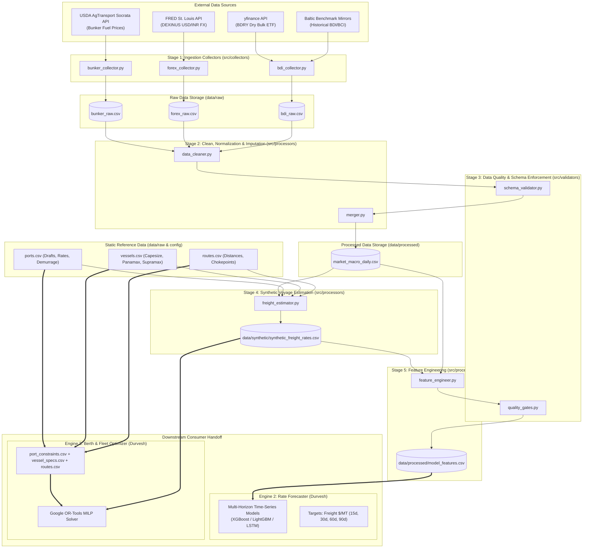

# System & Pipeline Architecture
## SIH26006: AI-Driven Bulk Coking Coal Logistics Optimizer

---

## 1. Architectural Overview

The SIH26006 platform is architected as an automated, modular, test-driven data engineering and analytics pipeline. The data layer bridges public maritime and financial macro-indicators with downstream predictive modeling (Engine 2) and constraint optimization solvers (Engine 3).



---

## 2. Directory Structure

The repository follows a standardized, production-grade layout separating raw inputs, intermediate artifacts, curated features, source code, execution scripts, and test suites:

```
SIH26006/
├── PRD.md                          # Product Requirements Document
├── PROJECT_CONTEXT.md              # Project status, data audit, and domain constraints
├── ARCHITECTURE.md                 # System and data pipeline architecture (this file)
├── TASKS.md                        # Task breakdown and implementation tracking
├── CHANGELOG.md                    # Historical record of changes and releases
├── AGENTS.md                       # Agent responsibilities and operating rules
├── README.md                       # High-level project summary and quickstart
├── requirements.txt                # Production and pipeline dependencies
├── .env.example                    # Template for environment variables and API tokens
├── .gitignore                      # Git ignore patterns for Python, caches, and datasets
│
├── data/                           # Data directory tree
│   ├── raw/                        # Ingested, unmodified external feeds & static tables
│   │   ├── bunker_raw.csv          # Raw USDA AgTransport bunker fuel data
│   │   ├── forex_raw.csv           # Raw FRED DEXINUS USD/INR daily exchange rates
│   │   ├── bdi_raw.csv             # Raw BDRY ETF and Baltic benchmark series
│   │   ├── ports.csv               # Port infrastructure, draft limits, daily discharge rates
│   │   ├── vessels.csv             # Bulk carrier fleet specs (Capesize, Panamax, Supramax)
│   │   └── routes.csv              # Origin-to-destination nautical distances & chokepoints
│   ├── processed/                  # Cleaned, standardized, merged, and validated data
│   │   ├── market_macro_daily.csv  # Merged daily calendar of fuel, FX, and dry bulk index
│   │   ├── port_constraints.csv    # Filtered operational constraint table for optimizer
│   │   ├── vessel_specs.csv        # Fleet speed, fuel burn, and DWT capacity specs
│   │   └── model_features.csv      # Curated ML feature matrix (lags, rolling averages)
│   ├── synthetic/                  # Physics-based synthetic estimation outputs
│   │   └── synthetic_freight_rates.csv  # Calculated route freight rates ($/MT)
│   └── metadata/                   # Pipeline run logs, data lineage, and schema audits
│       ├── pipeline_run.json       # Execution timestamp, record counts, and run health
│       └── schema_definition.json  # JSONSchema rules for downstream consumers
│
├── src/                            # Source code package
│   ├── __init__.py                 # Package root
│   ├── config/                     # Configuration management
│   │   ├── __init__.py
│   │   ├── settings.py             # Path definitions, environment variables, constants
│   │   └── logging_config.py       # Standardized logging formatter and handlers
│   ├── collectors/                 # Data acquisition modules
│   │   ├── __init__.py
│   │   ├── base_collector.py       # Abstract Base Class for collectors
│   │   ├── bunker_collector.py     # USDA Socrata API scraper / client
│   │   ├── forex_collector.py      # FRED CSV / API client for DEXINUS
│   │   └── bdi_collector.py        # yfinance client for BDRY & historical BDI
│   ├── processors/                 # ETL, cleaning, merging, and estimation logic
│   │   ├── __init__.py
│   │   ├── data_cleaner.py         # Timestamp alignment, outlier filtering, imputation
│   │   ├── freight_estimator.py    # Synthetic Voyage Estimation mathematical engine
│   │   └── feature_engineer.py     # Rolling stats, momentum, EWMA, lags
│   └── validators/                 # Data quality enforcement
│       ├── __init__.py
│       ├── schema_validator.py     # Strict dtype and column integrity validator
│       └── quality_gates.py        # Anomaly detection, null thresholds, range checks
│
├── scripts/                        # Automation and execution scripts
│   ├── run_pipeline.py             # Master pipeline entry point
│   ├── seed_static_data.py         # Generates reference ports, vessels, routes
│   └── export_handoff.py           # Exports files for Durvesh (ML/Opt) and Saurabh (API)
│
└── tests/                          # Automated test suite
    ├── __init__.py
    ├── conftest.py                 # Pytest fixtures and mock responses
    ├── test_collectors.py          # Unit tests for API collectors (mocked HTTP)
    ├── test_cleaner.py             # Unit tests for data cleaning and null imputation
    ├── test_freight_estimator.py   # Unit tests for synthetic voyage calculation physics
    ├── test_feature_engineer.py    # Unit tests for rolling window and lag generation
    └── test_schema_validator.py    # Unit tests verifying column types and constraints
```

---

## 3. Data Pipeline Stages & Operational Flow

The pipeline executes in sequential, decoupled stages managed by `run_pipeline.py`:

### Stage 1: Data Collection (`src/collectors/`)
1. **Bunker Collection (`bunker_collector.py`)**:
   - Queries the USDA AgTransport Open Data platform via Socrata API (`https://agtransport.usda.gov/resource/qq4h-644s.json`).
   - Filters for global bunkering ports (Singapore, Fujairah, Houston, Rotterdam).
   - Normalizes pricing to USD per metric tonne ($/MT) for Very Low Sulphur Fuel Oil (VLSFO) and Intermediate Fuel Oil (IFO 380).
   - Writes raw payload to `data/raw/bunker_raw.csv`.
2. **Forex Collection (`forex_collector.py`)**:
   - Ingests Federal Reserve Bank of St. Louis series `DEXINUS` via direct HTTP stream.
   - Extracts daily USD/INR spot exchange rates.
   - Parses date index and writes raw payload to `data/raw/forex_raw.csv`.
3. **Dry Bulk Sentiment Collection (`bdi_collector.py`)**:
   - Uses `yfinance` to fetch daily OHLCV series for `BDRY` (Breakwave Dry Bulk Shipping ETF).
   - Merges with curated historical Baltic Dry Index (BDI) static benchmark records.
   - Writes raw payload to `data/raw/bdi_raw.csv`.

### Stage 2: Cleaning & Normalization (`src/processors/data_cleaner.py`)
- **Calendar Alignment**: Standardizes all time series to a uniform business-day / daily calendar.
- **Missing Value Imputation**: Employs strictly backward-looking forward filling (`ffill()`) for holiday missingness. Future data is never used (eliminating temporal lookahead bias for ML).
- **Outlier Rejection**: Flags statistical spikes ($> 4 \sigma$ standard deviations from 30-day rolling mean) for manual inspection or cap-and-floor winsorization.
- **Merging**: Combines bunker, forex, and dry bulk sentiment into `data/processed/market_macro_daily.csv`.

### Stage 3: Schema Validation & Quality Gates (`src/validators/`)
- Checks column existence, non-null requirements, and numerical type bounds.
- Asserts the presence of the `data_type` audit column in every processed output.
- Rejects corrupt or truncated rows before data enters downstream estimation and modeling.

### Stage 4: Synthetic Voyage Estimation (`src/processors/freight_estimator.py`)
- Implements the maritime chartering economic model:
  $$\text{Freight Rate (\$/MT)} = \frac{C_{\text{bunker}} + C_{\text{port}} + C_{\text{canal}} + (R_{\text{charter}} \times T_{\text{roundtrip}})}{\text{Cargo Quantity (MT)}}$$
- Evaluates this formula across all 9 route combinations for Capesize (150k MT), Panamax (75k MT), and Supramax (55k MT) vessel classes.
- Integrates daily bunker prices and BDRY-indexed daily time-charter rates.
- Outputs `data/synthetic/synthetic_freight_rates.csv` flagged with `data_type = 'SYNTHETIC'`.

### Stage 5: Feature Engineering (`src/processors/feature_engineer.py`)
- Creates ML-ready predictive features for time-series forecasting:
  - **Lags**: 1-day, 3-day, 7-day, 14-day, 30-day historical lags for bunker prices, FX rates, and freight rates.
  - **Rolling Statistics**: 7-day, 14-day, 30-day, and 60-day rolling means, rolling standard deviations (volatility), and rolling min/max.
  - **Momentum Indicators**: Rate of Change (ROC), Relative Strength Index (RSI proxy), and percentage spreads against 30-day moving averages.
- Saves final tabular dataset to `data/processed/model_features.csv`.

---

## 4. Downstream Interface Contracts (Handoffs)

To guarantee flawless integration with Durvesh (ML/Optimization) and Saurabh (FastAPI Backend), the pipeline strictly adheres to the following data contracts:

### Contract A: ML Rate Forecaster Handoff (`data/processed/model_features.csv`)
- **Target Consumer**: Engine 2 (Durvesh - Rate Forecaster)
- **Update Frequency**: Daily batch
- **Key Columns & Dtypes**:
  - `date` (ISO-8601 string `YYYY-MM-DD`, indexed)
  - `vlsfo_price_usd_per_mt` (float64)
  - `usd_inr_exchange_rate` (float64)
  - `bdry_close_price` (float64)
  - `synthetic_freight_haypoint_paradip_capesize` (float64)
  - `synthetic_freight_haypoint_vizag_capesize` (float64)
  - `synthetic_freight_balikpapan_haldia_supramax` (float64)
  - `vlsfo_roll_mean_7d`, `vlsfo_roll_mean_30d`, `vlsfo_roll_std_30d` (float64)
  - `usd_inr_roll_mean_7d`, `usd_inr_pct_change_30d` (float64)
  - `freight_momentum_14d` (float64)
  - `data_type` (category: `REAL`, `DERIVED`, `ESTIMATED`, `SYNTHETIC`)
- **Quality Guarantees**: Zero null values in feature columns; zero forward-looking data leakage.

### Contract B: Berth & Dispatch Optimizer Handoff
- **Target Consumer**: Engine 3 (Durvesh - Google OR-Tools MILP Solver)
- **Delivered Files**:
  1. `data/processed/port_constraints.csv`:
     - Columns: `port_id`, `port_name`, `country`, `channel_draft_m`, `berth_max_draft_m`, `max_loa_m`, `max_beam_m`, `capesize_allowed` (bool), `panamax_allowed` (bool), `discharge_rate_mt_per_day`, `typical_waiting_days`, `demurrage_usd_per_day`.
  2. `data/processed/vessel_specs.csv`:
     - Columns: `vessel_class`, `dwt_min`, `dwt_max`, `typical_coking_coal_payload_mt`, `laden_draft_m`, `ballast_draft_m`, `loa_m`, `beam_m`, `service_speed_knots`, `laden_bunker_burn_mt_day`, `aux_port_burn_mt_day`.
  3. `data/processed/routes.csv`:
     - Columns: `route_id`, `origin_port`, `destination_port`, `distance_nautical_miles`, `canal_fees_usd`, `chokepoints`, `typical_weather_delay_pct`.
  4. `data/synthetic/synthetic_freight_rates.csv`:
     - Route-level baseline freight costs for objective function weighting.

---

## 5. Non-Functional Architecture & Implementation Standards

1. **Python Compatibility**: Python 3.11+. Strict static typing via Python `typing` (`Optional`, `Union`, `List`, `Dict`, `Tuple`).
2. **File Paths & Cross-Platform Support**: All filesystem operations use `pathlib.Path`. No hardcoded OS-specific path separators.
3. **Configuration & Secrets**:
   - Zero hardcoded credentials or endpoints.
   - All runtime options defined in `src/config/settings.py` backed by `pydantic-settings` or `python-dotenv`.
4. **Logging System**:
   - Standard Python `logging` module configured via `src/config/logging_config.py`.
   - Structured log format: `[%(asctime)s] [%(levelname)s] [%(name)s:%(lineno)d] %(message)s`.
   - Simultaneous console output and rotating file log under `data/metadata/pipeline.log`.
5. **Testing Strategy**:
   - Pytest test suite in `tests/` covering:
     - Collector HTTP mocks via `unittest.mock` / `pytest-mock`.
     - Deterministic unit tests for synthetic voyage cost math.
     - Pandas DataFrame schema and type assertion tests.
