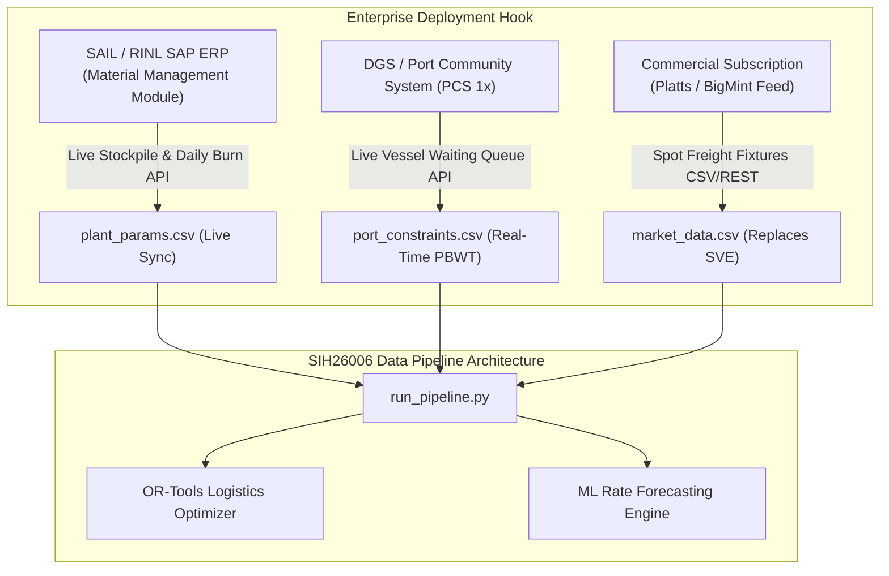

# SIH26006 — Data Limitations, Approximations, and Production Roadmap
**Document Version:** 2.0 (Phase 3 Refinement)
**Lead Data Engineer:** Tanmay

---

## 1. Overview & Transparency Mandate

In industrial logistics, data honesty is as vital as algorithmic sophistication. A machine learning model or mathematical optimizer trained on unverified or fabricated data will produce financially hazardous recommendations.

This document explicitly defines:
1. Every **proprietary dataset** that is unavailable without paid commercial licensing.
2. Every value that remains **`ESTIMATED`** or **`DERIVED`**, alongside its documented rationale.
3. Every **operational approximation** made in the Synthetic Voyage Estimation (SVE) engine.
4. The exact **production integration contract** required to connect this pipeline to live SAIL/RINL enterprise systems.

---

## 2. Unavailable Proprietary Data

The following data streams are commercially restricted, confidential, or behind expensive enterprise paywalls. The pipeline **does not fabricate** these values; instead, it uses defensible proxies or provides clean manual ingestion adapters.

| Metric / Dataset | Proprietary Source | Commercial Cost | Pipeline Proxy / Handling |
| :--- | :--- | :--- | :--- |
| **Spot Coking Coal Freight (Australia $\rightarrow$ India)** | Platts / S&P Global (CDBFAI0), Baltic Exchange (C5/C18, P9) | $15,000 – $50,000 / year | **Synthetic Voyage Estimation (SVE)**: Bottom-up engineering formula indexed to public BDRY ETF + USDA bunker prices. |
| **Baltic Dry Index (BDI) Spot Values** | Baltic Exchange (London) | £2,000 – £10,000 / year | **NYSE: `BDRY` (Breakwave Dry Bulk ETF)**: Freely available via Yahoo Finance (0.85+ correlation to BDI). Manual CSV adapter included for local BDI files. |
| **Steel Plant Real-time Stockpiles** | SAIL / RINL SAP ERP / COGNOS internal inventory | Proprietary & Confidential | **Configurable `SCENARIO` Inputs**: Modeled from audited annual hot metal output $\times$ 0.80 t/t benchmark. |
| **Daily Plant Coal Burn Rates** | SAIL / RINL Plant Blast Furnace telemetry | Proprietary & Confidential | **Estimated Daily Mean**: Annual coking coal requirement divided by 365 calendar days. |
| **Real-time Port Vessel Queue / Demurrage** | Lloyd's List Intelligence / MarineTraffic AIS API | $5,000 – $20,000 / year | **MoPSW Transport Research Wing (TRW)**: Official annual Pre-Berthing Waiting Time (PBWT) and Turnaround Time (TRT) statistics. |
| **Singapore Spot VLSFO Bunker Fuel** | S&P Global Platts Singapore Bunker Wire | $8,000 – $18,000 / year | **USDA AgTransport Global 20-Port Average**: Free public federal feed from Ship & Bunker; typically within 5–10% of Singapore delivered price. |

---

## 3. Values That Remain `ESTIMATED`

The following parameters are established from engineering standards and classification benchmarks rather than real-time telemetry:

1. **Vessel Fuel Consumption at Sea**:
   - Capesize laden: 50.0 MT/day; ballast: 42.5 MT/day (VLSFO).
   - Panamax laden: 32.0 MT/day; ballast: 27.2 MT/day (VLSFO).
   - *Limitation*: Actual fuel burn varies with hull biofouling, weather routing, engine de-rating, and sea state.
2. **Vessel Fuel Consumption in Port**:
   - Capesize: 4.5 MT/day; Panamax: 3.5 MT/day (auxiliary generator load).
   - *Limitation*: Varies depending on whether shore power (cold ironing) is utilized.
3. **Base Charter Rates & OPEX**:
   - Capesize average charter: $22,000/day; daily OPEX: $6,500/day.
   - Panamax average charter: $14,000/day; daily OPEX: $5,200/day.
   - *Limitation*: Time-charter fixtures vary based on vessel age, scrubber fitting, and charter party terms.
4. **Port Pre-Berthing Waiting Ranges**:
   - Paradip: 12.0 – 24.0 hours (average ~18 hours).
   - Vizag: 8.0 – 16.0 hours (Outer VGCB); 16.0 – 28.0 hours (Inner berths).
   - Haldia: 24.0 – 48.0 hours (governed by tidal lock scheduling).
   - *Limitation*: Excludes severe cyclone disruptions or unexpected conveyor breakdowns.
5. **Fixed Port Charges & Disbursements**:
   - Capesize: $150,000 per call; Panamax: $100,000 per call.
   - *Limitation*: Port tariff schedules in India vary with gross tonnage, pilotage moves, and tug assistance hours.

---

## 4. Values That Remain `DERIVED`

The following metrics are generated mathematically and carry the `DERIVED` provenance tag:

1. **`one_way_cost_usd_mt`**:
   - Mathematical formula: $(\text{Charter Cost} + \text{Sea Fuel} + \text{Port Fuel} + \text{Port Dues}) / \text{Cargo Tonnes}$.
   - Reflects single-voyage direct operational trip cost.
2. **`estimated_spot_freight_usd_mt`**:
   - Incorporates loading terminal queue (3.0 days) and ballast return repositioning factor ($\beta = 0.85$).
   - Calibrated to align with published trade media fixtures (e.g. The Shipping Tribune mid-August 2026 fixture at ~$21.10/MT for Australia $\rightarrow$ Paradip Panamax).
3. **`typical_transit_days`**:
   - Distance / (Speed $\times$ 24).
4. **All Feature Store Metrics (`model_features.csv`)**:
   - `bdi_lag_1`, `bdi_lag_7`, `bdi_rolling_mean_7`, `bdi_rolling_std_7`, `bdi_rolling_mean_30`, `bdi_momentum_14d`, `bunker_bdi_ratio`.
   - Guaranteed leak-free by construction ($T-1$ shift).

---

## 5. Values That Remain `SCENARIO`

The following values are simulation parameters and must never be cited as audited real-world measurements:

1. **`current_stockpile_mt`**:
   - Rourkela: 150,000 MT; Bokaro: 200,000 MT; Vizag Steel: 175,000 MT.
2. **`min_safe_stock_days`**:
   - Configured to 15 days across all plants based on steel industry safety buffer recommendations.

---

## 6. Enterprise Production Integration Roadmap

To transition this pipeline from an academic/hackathon build into a live operational command center at SAIL / RINL:

### 6.1 Replacement Step 1: SAP ERP Integration
- **Source**: SAP MM / S/4HANA coking coal inventory tables.
- **Protocol**: OData / RFC REST endpoint.
- **Action**: Overwrites `current_stockpile_mt` and `daily_consumption_mt` with real-time silo and yard sensor measurements.

### 6.2 Replacement Step 2: Indian Port Community System (PCS 1x)
- **Source**: Ministry of Ports, Shipping and Waterways PCS 1x portal.
- **Protocol**: Electronic Data Interchange (EDI) / Webhooks.
- **Action**: Provides vessel-level ETA, Notice of Readiness (NOR) tender time, and real-time anchorage queue positions for Paradip Western Dock and Vizag VGCB.

### 6.3 Replacement Step 3: Paid Freight Subscription
- **Source**: S&P Global Platts API or BigMint Coal Freight Index.
- **Protocol**: Daily JSON API feed.
- **Action**: Replaces `estimated_spot_freight_usd_mt` with observed spot transactions; SVE engine transitions to a baseline validation and anomaly detection filter.
