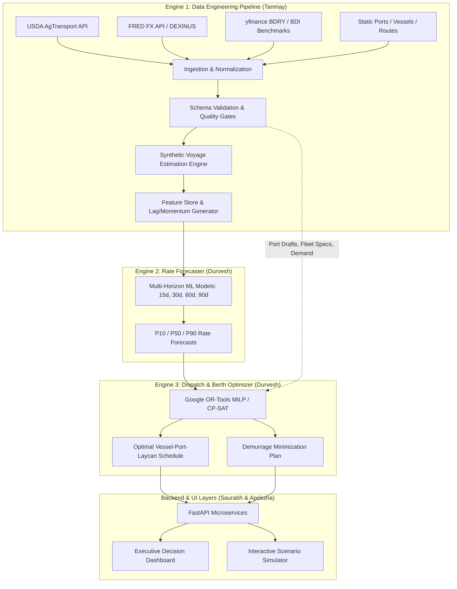
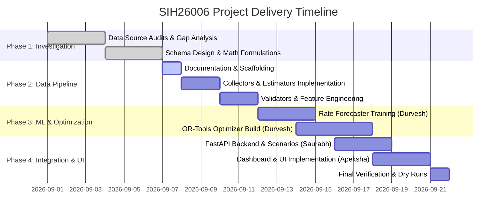

# Product Requirements Document (PRD)
## SIH26006: AI-Driven Bulk Coking Coal Maritime Logistics Decision-Support Platform

---

### Document Metadata
- **Project ID**: SIH26006
- **Document Version**: 1.0.0
- **Status**: Approved for Implementation (Phase 2)
- **Last Updated**: 2026-09-07
- **Target Domain**: Maritime Logistics, Dry Bulk Shipping, Steel Manufacturing Raw Material Procurement
- **Lead Stakeholders**: Public Sector Steel Undertakings (SAIL, RINL)

---

## 1. Executive Summary & Problem Statement

### 1.1 The Industrial Challenge
India is the second-largest crude steel producer in the world. Modern blast furnace-basic oxygen furnace (BF-BOF) steelmaking requires high-grade metallurgical coking coal characterized by high coking propensity, low volatile matter, and critically, low ash content (<10–12%). Domestic Indian coal reserves are predominantly thermal-grade with high ash content (25%–35%), which causes slag formation and severe operational inefficiencies in blast furnaces. 

Consequently, India's public sector steel giants—notably the **Steel Authority of India Limited (SAIL)** and **Rashtriya Ispat Nigam Limited (RINL)**—import over 50–60 million metric tonnes (MT) of premium coking coal annually. This raw material is imported almost exclusively via maritime dry bulk routes:
- **Primary Origins**: 
  - **Australia (East Coast)**: Port of Gladstone, Hay Point Coal Terminal, Abbot Point Coal Terminal, and Dalrymple Bay Coal Terminal (DBCT).
  - **Indonesia (Kalimantan / Sumatra)**: Balikpapan, Samarinda, Muara Berau anchorage, Taboneo anchorage.
- **Primary Indian East Coast Discharge Ports**: 
  - **Paradip Port (Odisha)**: Feeds SAIL plants at Rourkela (RSP), Bokaro (BSL), and Durgapur (DSP).
  - **Visakhapatnam Port / Vizag (Andhra Pradesh)**: Directly feeds RINL's Visakhapatnam Steel Plant via dedicated conveyor and rail networks.
  - **Haldia Dock Complex / Kolkata (West Bengal)**: Feeds SAIL plants at Durgapur and IISCO Burnpur, but suffers from severe navigational draft constraints.

### 1.2 The Logistics Bottlenecks & Inefficiencies
Coking coal procurement and ocean logistics currently face multi-million-dollar inefficiencies:
1. **Extreme Freight Volatility**: Ocean dry bulk freight rates (governed by the Baltic Dry Index, Capesize/Panamax indices) fluctuate wildly—from $12/MT to over $45/MT—driven by global commodity demand, fleet availability, and geopolitical chokepoints.
2. **Bunker Fuel Price Shocks**: Very Low Sulphur Fuel Oil (VLSFO) and Marine Gas Oil (MGO) represent 40%–60% of total voyage operating costs. Price spikes at bunkering hubs (Singapore, Fujairah) immediately translate to bunker surcharges.
3. **Foreign Exchange Risk**: Ocean freight, vessel charter fixtures, and international coal purchases are denominated in USD, while domestic steel operations produce INR revenues. Currency depreciations (USD/INR) severely escalate landed raw material costs.
4. **Physical Port & Berth Asymmetries**:
   - **Paradip**: Deep draft (16.5m) capable of accommodating fully laden Capesize vessels (~150,000–180,000 DWT) at mechanized berths.
   - **Vizag**: Deep water (18.1m at VGCB) capable of handling 200,000 DWT Capesize bulkers.
   - **Haldia Dock Complex**: Riverine port with restrictive river bars, limiting allowable draft to 8.0m–9.1m. Capesize and fully laden Panamax vessels **cannot** call at Haldia without prior lightening at Paradip or Vizag, or routing smaller Supramax/Handymax parcels.
5. **Demurrage & Congestion Losses**: Pre-berthing delays and vessel waiting times at East Coast Indian ports frequently reach 3 to 8 days during peak seasons. With Capesize demurrage rates exceeding $25,000–$35,000/day and Panamax demurrage exceeding $15,000–$22,000/day, Indian PSUs bleed hundreds of crores in foreign exchange penalties annually.
6. **Fragmented Decision Tools**: Procurement officers currently rely on static spreadsheets, retroactive accounting, and disconnected communication between plant logistics, port authorities, and shipping brokers.

### 1.3 The Solution Vision
**SIH26006** is an integrated, AI-driven, multi-engine decision-support system engineered specifically for procurement and chartering officers at Indian public-sector steel plants. The system ingests global market intelligence, forecasts volatile shipping rates up to 90 days in advance, optimizes vessel charter fixtures, vessel parcel sizes, and discharge port allocations using constraint optimization, and provides interactive "what-if" scenario simulation.

---

## 2. Target Users & Stakeholders

| User Persona | Organization / Role | Key Responsibilities | Primary System Use Cases |
| :--- | :--- | :--- | :--- |
| **Chief Procurement Officer (CPO)** | SAIL / RINL Central Raw Materials Division | Strategic coal procurement, long-term contracts vs. spot chartering | High-level cost-per-tonne visibility, macro risk hedging, monthly procurement scheduling. |
| **Chartering & Logistics Manager** | SAIL International Trade Division / Shipping Desk | Fixturing vessels (Capesize vs. Panamax), laycan negotiation, spot market chartering | Rate forecasts (15–90 days), synthetic voyage cost benchmarks, fixture timing optimizer. |
| **Port Operations Coordinator** | Plant Logistics / Port Liaison Office (Paradip, Vizag, Haldia) | Port clearance, berth monitoring, demurrage mitigation, rake scheduling | Berth congestion monitoring, vessel turnaround estimation, lightening schedule optimization. |
| **Financial & Risk Analyst** | PSU Finance & Strategy Group | Budget variance analysis, foreign exchange hedging, landed cost audit | Scenario simulation (bunker shocks, USD/INR swings), total landed cost breakdowns. |

---

## 3. System Architecture & The Three Core Engines

The SIH26006 platform is structured around three interconnected, modular technical engines:

### 3.1 Engine 1: Data Engineering Pipeline (Owner: Tanmay)
The Data Engineering Pipeline forms the foundational bedrock of the platform. It is responsible for automated, reliable ingestion, cleaning, normalization, cross-validation, synthetic rate generation, and feature engineering.
- **Automated Data Ingestion**:
  - **Bunker Fuel Prices**: Free daily ingestion via USDA AgTransport Socrata Open Data API (`qq4h-644s.json`) capturing global bunker prices (VLSFO, IFO 380, MGO) at major bunkering nodes.
  - **Foreign Exchange Rates**: Federal Reserve Bank of St. Louis (FRED) API / daily CSV feeds for `DEXINUS` (USD/INR daily spot exchange rate).
  - **Dry Bulk Freight Market Sentiment**: Breakwave Dry Bulk Shipping ETF (`BDRY`) via `yfinance` to capture real-time market sentiment on freight futures (Capesize 50%, Panamax 40%, Supramax 10%), supplemented by historical Baltic Dry Index (BDI) datasets.
- **Synthetic Voyage Estimation Proxy**:
  - Addresses the industry-wide data paywall (where Baltic Exchange and Platts spot route fixtures are restricted).
  - Applies naval architecture and maritime chartering voyage accounting: calculates net fuel consumption, steaming days, auxiliary port fuel, port dues (D/A), canal fees, and prevailing time-charter rates to generate accurate spot freight estimates ($/MT) across all nine key route pairs.
- **Feature Engineering**:
  - Computes multi-span rolling averages (7d, 14d, 30d, 60d, 90d), exponential moving averages, rolling standard deviation (volatility), rolling min/max, and price momentum indicators.
- **Data Traceability Standard**:
  - Mandates a `data_type` categorical column in all output datasets with strict enumeration: `REAL`, `DERIVED`, `ESTIMATED`, `SYNTHETIC`.

### 3.2 Engine 2: Rate Forecaster (Owner: Durvesh)
The Rate Forecaster consumes curated, normalized features from Engine 1 and generates multi-horizon predictive curves for dry bulk charter rates and bunker fuel prices.
- **Prediction Horizons**: 15 days, 30 days, 60 days, and 90 days into the future.
- **Primary Target Variables**:
  - Route-specific spot freight rates ($/MT) for Hay Point $\rightarrow$ Paradip, Hay Point $\rightarrow$ Vizag, Balikpapan $\rightarrow$ Haldia, etc.
  - VLSFO Bunker Fuel Price ($/MT) at Singapore.
  - Landed Coking Coal Freight Cost Index (INR/MT).
- **Model Architectures**:
  - Gradient Boosted Decision Trees (LightGBM, XGBoost) for tabular macroeconomic and momentum features.
  - Prophet / NeuralProphet for seasonal trend decomposition.
  - LSTM / Temporal Fusion Transformer (TFT) for sequential time-series patterns.
- **Probabilistic Forecasting**:
  - Generates confidence intervals: $P_{10}$ (optimistic/bearish freight), $P_{50}$ (median expectation), and $P_{90}$ (risk-buffer/bullish freight) to support procurement hedging.

### 3.3 Engine 3: Dispatch & Berth Optimizer (Owner: Durvesh)
The Dispatch and Berth Optimizer models the physical procurement and maritime supply chain as a Mixed-Integer Linear Programming (MILP) and Constraint Programming (CP-SAT) problem formulated via **Google OR-Tools**.
- **Decision Variables**:
  - Vessel fixture dates ($t_{\text{fixture}}$) and laycan arrival windows ($[t_{\text{start}}, t_{\text{end}}]$).
  - Vessel parcel classification ($v \in \{\text{Capesize}, \text{Panamax}, \text{Supramax}\}$).
  - Origin coal allocation ($o \in \{\text{Gladstone}, \text{Hay Point}, \text{Balikpapan}\}$).
  - Discharge port assignment ($d \in \{\text{Paradip}, \text{Vizag}, \text{Haldia}\}$).
  - Transshipment/lightening split indicators (e.g., Capesize discharges 100k MT at Paradip, lightens draft to 11m, then proceeds to Haldia anchorage or transfers via coastal barges).
- **Objective Function**:
  $$\min Z = \sum (\text{Ocean Freight} + \text{Bunker Surcharges} + \text{Port Disbursements} + \text{Demurrage Penalty} + \text{Inland Rail Freight} - \text{Despatch Earned})$$
- **Physical & Operational Constraints**:
  - Draft limitation constraints: $D_{\text{vessel}}(\text{laden}) \le D_{\text{port\_channel\_max}}$.
  - Length Overall (LOA) and beam constraints per berth.
  - Monthly coking coal consumption demand by steel plant (Bhilai, Bokaro, Rourkela, Vizag).
  - Steel plant stockpile safety buffers (minimum 15 days, maximum 45 days of coal burn).
  - Indian Railways rake turnaround limits and daily dispatch capacities at port sidings.

---

## 4. Scenario Analysis & "What-If" Simulation

The platform empowers procurement directors to stress-test their logistical supply chain against adverse geopolitical and operational shocks through interactive simulations:

1. **Bunker Fuel Price Spike (+10% to +35%)**:
   - Simulates crude oil volatility, OPEC+ supply cuts, or regional disruptions around the Malacca Strait.
   - Evaluates impact on overall freight bill; automatically assesses whether slow-steaming (11 knots vs. 14 knots) reduces total voyage cost despite additional steaming days.
2. **Port Congestion & Pre-Berthing Delay Shocks (+3 to +8 days)**:
   - Simulates monsoon delays, cyclone warnings in the Bay of Bengal, or equipment breakdowns at Paradip/Vizag mechanized berths.
   - Re-optimizes vessel queueing; dynamically evaluates whether diverting an approaching Panamax vessel to Vizag or Haldia saves more in demurrage than the extra rail freight incurred.
3. **Foreign Exchange Shock (USD/INR Depreciation of 3% to 8%)**:
   - Quantifies the immediate impact on landed coal cost in INR.
   - Triggers procurement recommendations to lock forward fixtures or prioritize nearer Indonesian origins over Australian long-haul voyages.
4. **Vessel Size Reallocation (Panamax vs. Capesize Trade-Off)**:
   - Evaluates chartering two 75,000 DWT Panamaxes vs. one 150,000 DWT Capesize with lightening at Paradip for Haldia-bound parcels.

---

## 5. Functional Requirements Breakdown

| Req ID | Module / Component | Requirement Description | Priority |
| :--- | :--- | :--- | :--- |
| **FR-01** | Data Engineering | Daily automated ingestion of USDA AgTransport bunker prices without authentication lock. | P0 (Must Have) |
| **FR-02** | Data Engineering | Daily ingestion of FRED `DEXINUS` USD/INR exchange rate with backward filling for holidays. | P0 (Must Have) |
| **FR-03** | Data Engineering | Ingestion of `BDRY` ETF price history and Baltic Dry Index benchmark series. | P0 (Must Have) |
| **FR-04** | Data Engineering | Execution of Synthetic Voyage Estimation mathematical model for 9 origin-destination pairs. | P0 (Must Have) |
| **FR-05** | Data Engineering | Schema validation asserting data types (`REAL`, `DERIVED`, `ESTIMATED`, `SYNTHETIC`) and null checks. | P0 (Must Have) |
| **FR-06** | Data Engineering | Automated feature engineering outputting multi-horizon rolling statistics to `model_features.csv`. | P0 (Must Have) |
| **FR-07** | Rate Forecaster | Train and expose predictive models for 15, 30, 60, 90 days out with Mean Absolute Percentage Error (MAPE) < 8.5%. | P0 (Must Have) |
| **FR-08** | Rate Forecaster | Generate $P_{10}$, $P_{50}$, $P_{90}$ probability bands for rate forecasts. | P1 (Should Have) |
| **FR-09** | Dispatch Optimizer | Formulate Google OR-Tools MILP model respecting port draft limits, demurrage penalties, and steel plant demand. | P0 (Must Have) |
| **FR-10** | Dispatch Optimizer | Haldia draft gate constraint: Automatically reject direct Capesize or laden Panamax discharge at Haldia. | P0 (Must Have) |
| **FR-11** | Backend & API | FastAPI endpoints exposing pipeline triggers, forecast retrieval, and optimization execution. | P0 (Must Have) |
| **FR-12** | Scenario Simulation | Dynamic API endpoint accepting parameter deltas ($\Delta \text{Bunker}, \Delta \text{Congestion}, \Delta \text{FX}$) and returning re-optimized schedule. | P0 (Must Have) |
| **FR-13** | Frontend Dashboard | Interactive visualization of rate trends, confidence bands, vessel Gantt schedules, and cost breakdowns. | P1 (Should Have) |

---

## 6. Non-Functional Requirements (NFRs)

- **Execution Performance**:
  - Data engineering pipeline run duration: $< 45$ seconds from raw pull to feature generation.
  - Optimization solve time: $< 15$ seconds for a 90-day multi-vessel horizon under Google OR-Tools.
  - API endpoint response time: $< 500$ ms for cached forecasts; $< 3.0$ seconds for full scenario recalculation.
- **Reliability & Fault Tolerance**:
  - External API failure gracefully handled (cached historical data fallback with warning logs).
  - Zero unhandled exceptions during pipeline runs.
- **Auditability & Compliance**:
  - Every numerical data point traceable to source or mathematical formulation.
  - Explicit marking of all synthetic and estimated values for PSU audit compliance.
- **Maintainability & Code Standards**:
  - Python 3.11+, 100% type-hinted code signatures, Google/Sphinx style docstrings, clean separation of concerns.
  - Strict secret isolation: API keys and credentials managed via `.env`, never committed to source control.

---

## 7. Delivery Milestones & Timeline

