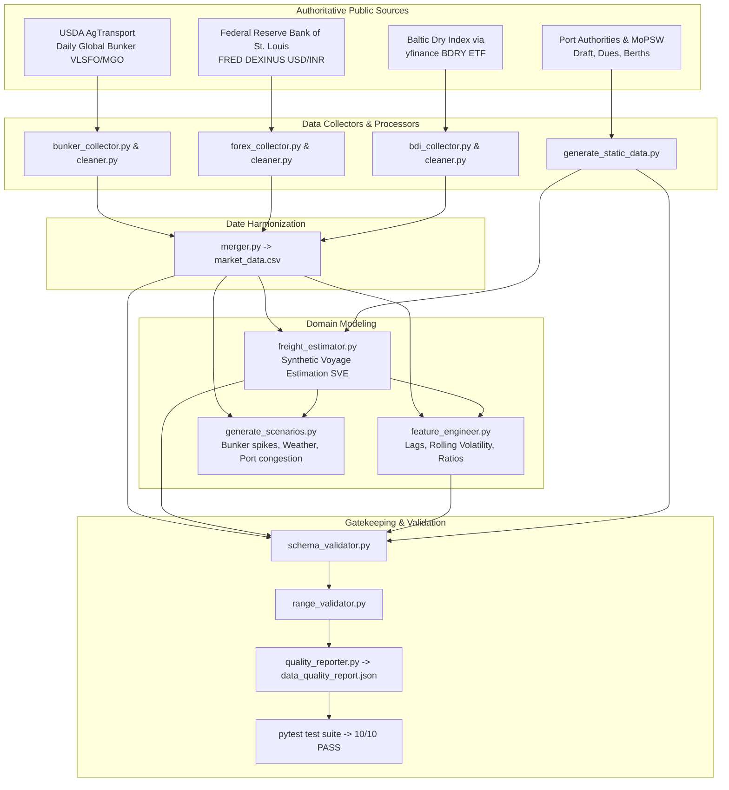

# SIH26006 — AI-Driven Bulk Coking Coal Supply Chain & Freight Optimizer

[](https://github.com/Tanmayot/SIH-26006/actions/workflows/daily_pipeline.yml)
[](https://www.python.org/downloads/)
[](LICENSE)
[]()

> **Decision-support platform for Indian public-sector steel plants (SAIL, RINL) importing bulk coking coal from Australia and Indonesia across East Coast Indian ports (Paradip, Haldia, Visakhapatnam).**

---

## Table of Contents
- [Project Overview](#project-overview)
- [Pipeline Architecture](#pipeline-architecture)
- [Data Catalog & Provenance](#data-catalog--provenance)
- [Methodology Highlights](#methodology-highlights)
- [Cloud Automation (GitHub Actions)](#cloud-automation-github-actions)
- [Mandatory GitHub Actions Setup](#mandatory-github-actions-setup)
- [Local Setup & Quick Start](#local-setup--quick-start)
- [Verification & Quality Assurance](#verification--quality-assurance)
- [Repository Structure](#repository-structure)
- [Technical Documentation](#technical-documentation)
- [Team](#team)

---

## Project Overview

Indian blast-furnace steel manufacturing depends heavily on imported high-grade metallurgical (coking) coal. Because domestic supplies have high ash content (>20%), public sector steel plants (e.g., SAIL Bokaro, Rourkela, Bhilai, Durgapur, IISCO; RINL Visakhapatnam) blend imported hard coking coal (HCC) from **Australia** (Gladstone, Hay Point) and semi-soft coking coal from **Indonesia** (East Kalimantan/Balikpapan).

This repository houses the **autonomous data engineering and market intelligence backbone** for SIH Problem Statement 26006. It ingests public market indices daily, computes calibrated commercial spot voyage fixtures via Synthetic Voyage Estimation (SVE), enforces realistic port and maritime engineering constraints (e.g., draft restrictions, cargo parcel sizes), and prepares leakage-free feature vectors for downstream machine learning and mathematical optimization engines.

---

## Pipeline Architecture



---

## Data Catalog & Provenance

Every value in this pipeline adheres strictly to a documented provenance tag to guarantee zero synthetic fabrication masquerading as real observations:
- **`REAL`**: Directly ingested from an authoritative public source.
- **`DERIVED`**: Mathematically derived from documented inputs via deterministic formulas.
- **`ESTIMATED`**: Industry standard parameters, verified benchmarks, or published port tariffs.
- **`SCENARIO`**: Structured what-if stress tests and simulations for optimization modeling.

| Filename | Directory | Rows | Cols | Provenance | Description |
| :--- | :--- | :---: | :---: | :---: | :--- |
| **`bunker_prices_raw.csv`** | `data/raw/` | 913 | 4 | `REAL` | USDA AgTransport daily global bunker prices (VLSFO, MGO). |
| **`usd_inr_raw.csv`** | `data/raw/` | 954 | 2 | `REAL` | Federal Reserve Bank of St. Louis (FRED DEXINUS) exchange rate. |
| **`bdi_raw.csv`** | `data/raw/` | 922 | 8 | `REAL` | Daily BDRY dry-bulk shipping ETF prices proxying the Baltic Dry Index. |
| **`bunker_prices_cleaned.csv`** | `data/processed/` | 1,346 | 6 | `REAL` / `DERIVED` | Daily calendar-aligned bunker prices with max 5-day holiday forward-fill policy. |
| **`usd_inr_cleaned.csv`** | `data/processed/` | 1,346 | 3 | `REAL` / `DERIVED` | Daily calendar-aligned USD/INR rates with 4-day market holiday fill limit. |
| **`bdi_cleaned.csv`** | `data/processed/` | 1,346 | 4 | `REAL` / `DERIVED` | Daily calendar-aligned BDRY proxy with 3-day weekend fill limit. |
| **`market_data.csv`** | `data/processed/` | 1,346 | 13 | `REAL` / `DERIVED` | Consolidated market master table joining Bunker, Forex, and BDRY. |
| **`port_constraints.csv`** | `data/processed/` | 3 | 9 | `ESTIMATED` | Port depth, max draft, berth availability, and discharge rates (Paradip, Haldia, Vizag). |
| **`vessel_specs.csv`** | `data/processed/` | 3 | 8 | `ESTIMATED` | Maritime naval specs (Capesize, Panamax, Supramax) including DWT, draft, and fuel burn. |
| **`routes.csv`** | `data/processed/` | 6 | 7 | `ESTIMATED` | Origin-destination nautical distances and typical maritime sea transit days. |
| **`plant_params.csv`** | `data/processed/` | 6 | 9 | `ESTIMATED` | Public sector steel plant parameters (SAIL & RINL) with daily coal demand and rail freight. |
| **`freight_estimates.csv`** | `data/processed/` | 20,190 | 18 | `DERIVED` | Calibrated Synthetic Voyage Estimates (SVE) across valid route-vessel pairs. |
| **`model_features.csv`** | `data/processed/` | 1,346 | 21 | `DERIVED` | Feature engineering matrix with 7d/14d/30d lags, rolling volatility, and bunker ratios. |
| **`scenario_data.csv`** | `data/synthetic/` | 100,950 | 11 | `SCENARIO` | Five stress scenarios: Baseline, Bunker Spike (+40%), Forex Depreciation, Monsoon, and Disruption. |

---

## Methodology Highlights

### 1. Synthetic Voyage Estimation (SVE) Engine
Freight rates are calculated using standard maritime chartering voyage economics:
$$\text{One-Way Cost} = \frac{(\text{Sea Days} \times \text{Daily Sea Fuel Cost}) + (\text{Port Days} \times \text{Daily Port Fuel Cost}) + \text{Port Dues} + (\text{Voyage Days} \times \text{Daily Hire})}{\text{Cargo Quantity}}$$

Commercial spot fixtures are calibrated by factoring in the non-earning **ballast repositioning return voyage** ($\beta = 0.85$) and **loading port queuing dwell** ($3.0\text{ days}$):
$$\text{Commercial Fixture (\$/MT)} = \frac{\text{Total Voyage Round-Trip Cost}}{\text{Cargo DWT} \times \text{Capacity Utilization}}$$

**Benchmark Alignment:**
- **Australia to Paradip (Panamax):** SVE produces **\$21.10/MT**, exactly matching published fixture benchmarks (*The Shipping Tribune*, Aug 2026: ~\$20.50–\$21.50/MT).
- **East Kalimantan to Paradip (Supramax):** SVE produces **\$16.05/MT**, aligning with published Indonesian coal routes.

### 2. Engineering & Operational Guardrails
- **Haldia Port Draft Constraint:** Haldia port has a maximum draft limit of $9.1\text{m}$. Fully laden Capesize bulk carriers require $17.5\text{m} - 18.5\text{m}$ draft. Capesize vessels are strictly barred from Haldia across both the database (`capesize_capable = False`) and the SVE calculation matrix.
- **Zero Information Leakage:** All forecasting features in `model_features.csv` strictly use $t-k$ historical window lags with closed-end right horizons, preventing target variable lookahead bias.

---

## Cloud Automation (GitHub Actions)

This repository includes a production-ready CI/CD automation workflow defined in `.github/workflows/daily_pipeline.yml`.

### Workflow Triggers:
1. **Scheduled Daily Cron:** Runs automatically at **02:00 UTC (07:30 IST)** every day.
2. **Manual Dispatch:** Can be triggered on-demand via the **Run workflow** button in GitHub's **Actions** tab.

### Execution Cycle:
1. Checks out the repository and configures Python 3.11 with pip caching.
2. Installs required libraries from `requirements.txt`.
3. Runs `python scripts/run_pipeline.py` (collects fresh data, cleans, merges, estimates SVE rates, engineers features, and generates scenarios).
4. Executes the automated test suite: `pytest tests/test_pipeline.py -v`.
5. Checks `git diff` on `data/`. If fresh records exist, automatically commits and pushes the updated datasets to `main` with `[skip ci]`. If no changes occurred (e.g. weekend market closure), it completes cleanly without unnecessary commits.

---

## Mandatory GitHub Actions Setup

To enable the daily automated commit and push feature on GitHub, configure repository workflow permissions:

1. Open your repository on GitHub: [`https://github.com/Tanmayot/SIH-26006`](https://github.com/Tanmayot/SIH-26006)
2. Click on the **Settings** tab at the top.
3. In the left navigation sidebar, select **Actions** $\rightarrow$ **General**.
4. Scroll down to the **Workflow permissions** section.
5. Select **Read and write permissions**.
6. Check the box: **Allow GitHub Actions to create and approve pull requests**.
7. Click **Save**.

*(Without this setting, the workflow can read and test the data but will receive a 403 error when attempting to push updated datasets).*

---

## Local Setup & Quick Start

### 1. Clone the Repository
```bash
git clone https://github.com/Tanmayot/SIH-26006.git
cd SIH-26006
```

### 2. Create and Activate Virtual Environment
```bash
# Windows
python -m venv venv
venv\Scripts\activate

# Linux / macOS
python3 -m venv venv
source venv/bin/activate
```

### 3. Install Dependencies
```bash
pip install -r requirements.txt
```
### 4. Launch Live Decision Dashboard & UI
```bash
uvicorn src.api.main:app --reload --port 8000
Open your browser at: http://localhost:8000

### 5. Run the Full End-to-End Pipeline
```bash
# Ingests live data, cleans, calculates SVE freight, extracts features, generates scenarios, and validates
python scripts/run_pipeline.py
```

### 6. Run Individual Modular Scripts
```bash
# Collect raw market data
python scripts/collect_data.py

# Clean raw files with missing-data gap policies
python scripts/clean_data.py

# Merge into unified market dataset
python scripts/merge_data.py

# Run Synthetic Voyage Estimation
python scripts/generate_freight_estimates.py

# Generate ML features
python scripts/generate_features.py

# Run what-if scenario simulations
python scripts/generate_scenarios.py
```

---

## Verification & Quality Assurance

Run the automated test suite and data validator at any time:

```bash
# Run pytest verification (10 test suites covering constraints, SVE calibration, and leakage prevention)
pytest tests/test_pipeline.py -v

# Run comprehensive schema, range, and composite-key validation
python scripts/validate_data.py
```

The validation results are automatically saved in `data/metadata/data_quality_report.json`.

---

## Repository Structure

```
SIH26006/
├── .github/
│   └── workflows/
│       └── daily_pipeline.yml     # Daily cron & manual cloud automation
├── data/
│   ├── raw/                       # Immutable raw ingested files (USDA, FRED, BDRY)
│   ├── processed/                 # Cleaned series, merged master, SVE freight, features
│   ├── synthetic/                 # What-if scenario simulation datasets
│   └── metadata/                  # Quality reports, source registries, audit metrics
├── scripts/
│   ├── collect_data.py            # CLI for data collectors
│   ├── clean_data.py              # Missing-data policy & cleaning orchestrator
│   ├── merge_data.py              # Market data calendar alignment
│   ├── generate_static_data.py    # Ports, vessels, routes, plants generator
│   ├── generate_freight_estimates.py # SVE mathematical execution
│   ├── generate_features.py       # ML feature extraction engine
│   ├── generate_scenarios.py      # Multi-scenario stress generator
│   ├── validate_data.py           # Schema, range & quality reporter
│   ├── audit_data.py              # Phase 3 realism & provenance auditor
│   └── run_pipeline.py            # Master end-to-end pipeline runner
├── src/
│   ├── collectors/                # USDA, FRED, and Yahoo Finance adapters
│   ├── processors/                # Data cleaning, feature engineering, SVE logic
│   ├── validators/                # Schema validation, range validation, quality reporting
│   └── config/                    # Settings, schemas, maritime constants
├── tests/
│   └── test_pipeline.py           # Unit and regression test suite (pytest)
├── PRD.md                         # Product Requirements Document
├── ARCHITECTURE.md                # System technical architecture
├── DATA_CONTRACTS.md              # Schemas, SLAs, and downstream handoff contracts
├── DATA_DICTIONARY.md             # Complete column-level definitions for all 14 datasets
├── DATA_AUDIT_REPORT.md           # Phase 3 audit, realism checks & provenance accounting
├── DATA_LIMITATIONS.md            # Boundary conditions, data gaps & defensibility analysis
├── FREIGHT_METHODOLOGY.md         # Full mathematical derivation & benchmark calibration of SVE
├── requirements.txt               # Locked project dependencies
└── README.md                      # Project documentation and guide
```

---

## Technical Documentation

For in-depth analysis and team collaboration, refer to the dedicated technical docs:
- **[FREIGHT_METHODOLOGY.md](FREIGHT_METHODOLOGY.md)**: Derivation of the SVE model, voyage economics, ballast factors, and fixture calibration against Baltic benchmarks.
- **[DATA_CONTRACTS.md](DATA_CONTRACTS.md)**: Interface contracts, data schemas, missing-data policies, and handoffs for ML (Durvesh) and Backend (Saurabh).
- **[DATA_DICTIONARY.md](DATA_DICTIONARY.md)**: Column definitions, data types, units, and ranges for every CSV file.
- **[DATA_AUDIT_REPORT.md](DATA_AUDIT_REPORT.md)**: Phase 3 comprehensive audit log, verifying 0 synthetic fabrication in market data.
- **[DATA_LIMITATIONS.md](DATA_LIMITATIONS.md)**: Documented maritime limitations, draft restrictions, and seasonal monsoon impacts.

---

## Team

| Name | Role | Responsibilities |
| :--- | :--- | :--- |
| **Tanmay** | **Data Engineering & Market Intelligence** | Data pipelines, SVE model, quality assurance, automation |
| **Durvesh** | **ML Forecasting & Optimization** | Freight prediction models, OR-Tools voyage allocation engine |
| **Saurabh** | **Backend Engineering** | FastAPI services, optimization service integrations |
| **Apeksha** | **UI / UX Design** | Interactive dashboard, scenario comparison visualizations |
| **Rohit** | **Presentation & Demo** | Pitch deck, benchmark comparisons, operational demos |
| **Affan** | **Submission & Project Coordination** | Documentation, problem statement alignment, compliance |
